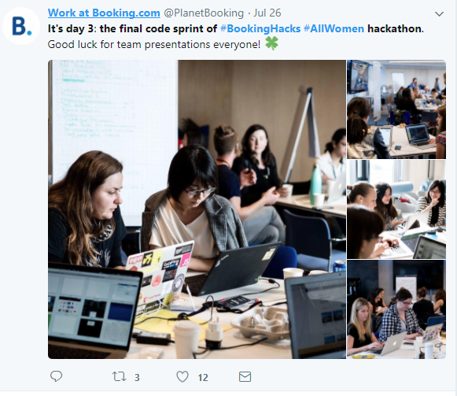

# Women In Tech Hackathon

This project contains the source code for a 3-day [Women In Tech Hackathon](https://www.hackerrank.com/booking-womenintech?utm_source=booking-passionshacked-promo&amp;utm_medium=email&amp;utm_campaign=booking-passionshacked) held by [Booking.com](https://www.booking.com/) during 24th to 26th July, 2017 in Amsterdam.

## Who attended

As the hackathon's name emphasized, all the attendees were women, however with rich diversity - 20 nationalities and 5 kinds of expertise (Product Owner, Copywriter, UI designer, front-end developer, back-end developer). And I, as a Chinese, flew from Tokyo, Japan (my current living place) and joined as a back-end developer.

## What I did

I developed the whole back-end system with the following functionalities:

- web clawer to pull down places of interests of real-world users
- RESTful APIs about
  - autocompletion for places of interests
  - CRUD operations for places of interests
  - places of interests recommendation

## What I used

- Python for web crawling
- MongoDB for data storage
- Spring Boot for RESTful APIs
- Google APIs for geographic information

## What I looked like

